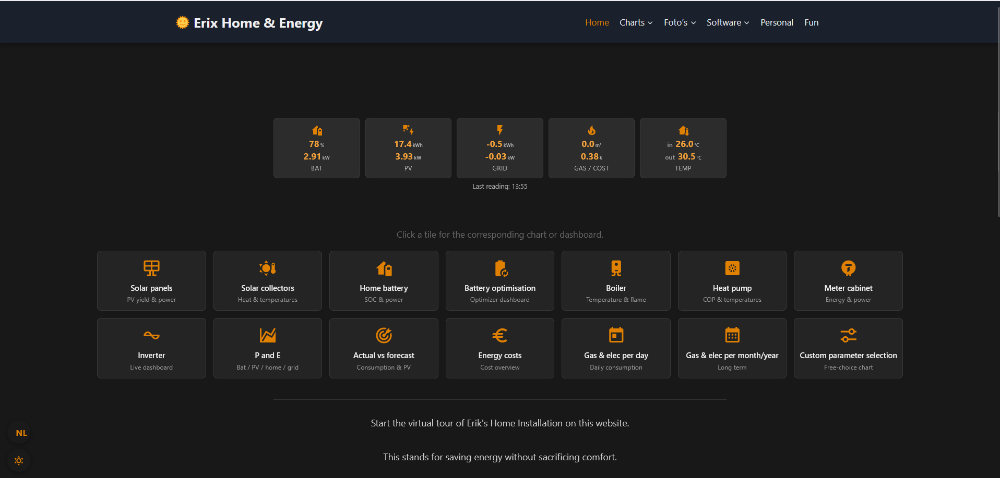
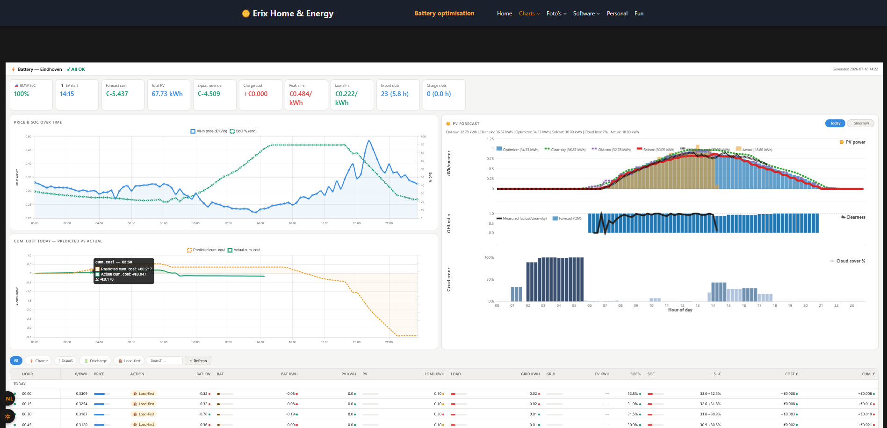
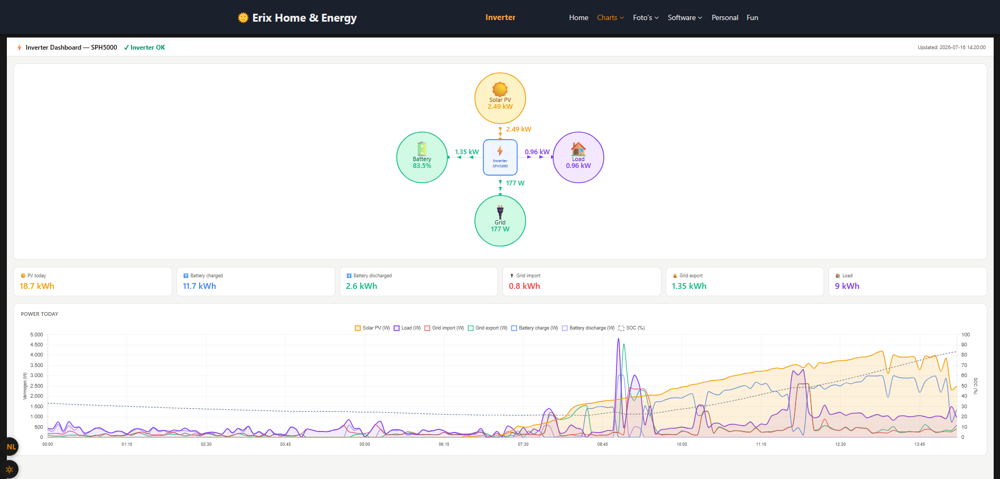

<h1 align="center">Predictive Home Energy Management System (EMS)</h1>

<p align="center">
  <em>Local-first • Docker • Raspberry Pi • Dynamic pricing • Solar forecasting • Battery optimisation</em>
</p>

<p align="center">
  
</p>

---

## Overview

**Home Energy System** is a fully autonomous Energy Management System (EMS) for residential battery
storage built around a **Growatt SPH5000** hybrid inverter and a **Seplos LiFePO₄** battery.

Unlike Home Assistant automations that *react* to changing conditions, this system continuously
**predicts**, **optimises**, and **controls** the complete installation.

Every 15 minutes it recalculates the optimal operating strategy for the next **48 hours**, taking
into account:

- Dynamic electricity prices (EPEX / EnergyZero)
- Solar production forecasts (KNMI HARMONIE, Open-Meteo, Solcast, CAMS, and a satellite nowcast)
- Historical household consumption
- Battery limits and cell health
- Weather forecasts
- Electric vehicle charging
- Grid import/export tariffs and netting rules

The result is a complete charge/discharge schedule that is automatically translated into Modbus
commands for the inverter.

No vendor cloud sits in the control path — the optimiser and all control logic run entirely on a
single Raspberry Pi. Only prices and forecasts are fetched from public APIs.

---

## Why this project?

Many open-source energy projects focus on **monitoring**. Some focus on **automation**.
This project focuses on **optimisation**.

It continuously answers one question:

> **"What is the cheapest and safest way to operate the entire home energy system over the next 48 hours?"**

Electricity prices, weather forecasts, solar production forecasts, battery constraints and
historical consumption are folded into a single mathematical optimisation problem (MILP). The
result is a continuously updated operating schedule for the inverter and battery.

It is not a demo. The system runs unattended in a real house — the battery currently reports
**98.4 % state of health after 155 cycles**.

---

## Screenshots

### Predictive battery optimisation

<p align="center">
  
</p>

The optimisation dashboard visualises dynamic electricity prices, predicted battery
state-of-charge, the PV production forecast, cloud cover, expected household consumption,
cumulative cost, and the charge/discharge schedule. The optimiser recalculates the complete plan
every 15 minutes over a rolling 48-hour horizon (192 quarter-hour slots).

### Live energy flow

<p align="center">
  
</p>

Real-time power flows between solar PV, the Growatt inverter, the battery, household loads and the
utility grid — allowing immediate verification of the optimisation strategy.

---

## Main features

- Fully autonomous Energy Management System
- Local-first architecture — no vendor cloud in the control path
- Docker-based microservices on a single Raspberry Pi 5
- Growatt SPH5000 Modbus control
- Native Seplos BMS integration (cell-level protection)
- Dynamic electricity prices and automatic battery arbitrage
- Multi-source solar forecasting, including a 0–4 h satellite nowcast
- DSMR P1 smart meter support
- Home Assistant integration and MQTT messaging
- MariaDB time-series database
- BMW EV integration (CarData)
- Solar thermal and OpenTherm boiler monitoring
- Battery lifetime protection and automatic PV curtailment
- Rolling 48-hour optimisation
- Safety guards that operate independently of the optimiser

---

## System architecture

```
     Weather forecasts · Electricity prices · BMW CarData · Home Assistant
                                   │
                                   ▼
                    ┌───────────────────────────────┐
                    │   battery_optimizer  (MILP)   │
                    │    rolling 48 h / 192 slots   │
                    └───────────────┬───────────────┘
                                    │  operating schedule
                                    ▼
                    ┌───────────────────────────────┐
                    │         read_growatt          │
                    │      inverter controller      │
                    └───────┬───────────────┬───────┘
                            ▼               ▼
                    Growatt SPH5000     Seplos BMS
                            │               │
                            └───────┬───────┘
                                    │  real-time measurements
     DSMR · PV · heat pump · boiler · EV · solar thermal · BMS
                                    │
                                    ▼
                                 MariaDB
```

---

## Software components

Nine services plus MariaDB, each an independent Docker container.

| Service | Description |
|---------|-------------|
| `battery_optimizer` | Predictive optimisation engine (MILP, 48 h horizon) |
| `read_growatt` | Growatt inverter controller + BMS current limits |
| `read_seplos` | Seplos BMS interface and cell protection |
| `read_p1` | DSMR smart meter interface + Modbus meter emulation |
| `read_bmw` | BMW CarData integration (EV SoC, location) |
| `read_knmi` | KNMI satellite solar-radiation nowcast (0–4 h) |
| `read_resol` | Solar thermal monitor (VBus) |
| `read_otthing` | OpenTherm gateway reader |
| `transfer_p60` | Weheat P60 heat pump integration |
| `MariaDB` | Central time-series database |

---

## Canonical inverter action names

These names are shared *exactly* between `battery_optimizer` and `read_growatt`. Any deviation
breaks the schedule pipeline.

| Action | Meaning |
|--------|---------|
| `LOAD_FIRST` | Inverter autonomous — PV and battery cover load |
| `BATTERY_FIRST+CHARGE` | Charge from grid and/or PV at the scheduled rate |
| `BATTERY_FIRST+PV_CHARGE` | Charge from PV only (AC charging disabled) |
| `BATTERY_FIRST+DISCHARGE` | Discharge battery aggressively |
| `STANDBY` | Battery fully passive — both Growatt and Seplos registers zeroed |

---

## Safety constraints (non-negotiable)

Battery safety always overrides the optimiser.

- Battery SoC: **20 % hard floor**, **89.5 % max** (the Seplos BMS trips at 89.8 %)
- Charge/discharge rate: **≤ 3.0 kW**
- Cell protection: dynamic current tapering on cell voltage, cell imbalance and temperature,
  written straight to the Seplos PCS registers by `read_seplos`
- Guards run independently of the optimiser and can override any schedule

---

## Hardware

The reference installation:

| Device | Role |
|--------|------|
| Raspberry Pi 5 (8 GB) + MariaDB on USB SSD | Runs the whole stack |
| Growatt SPH5000 (2 × RS485/USB) | Hybrid inverter — PV, battery, grid, loads |
| Seplos 16 kWh LiFePO₄ (RS485/USB) | Battery, 20–89.5 % operating range |
| Solar PV 6.24 kWp | Two strings: east (88°) + west (272°), 35° tilt |
| DSMR P1 smart meter (wifi) | Real-time grid import/export |
| BMW 225XE | 7.7 kWh, 2.3 kW AC charge via smart plug |
| Weheat Sparrow P60 heat pump (cloud) | Main space-heating load |
| Resol solar controller (ethernet) | Solar thermal (DHW + wood gasifier) |
| OTThing OpenTherm gateway (wifi) | Honeywell Sparrow60 boiler |

Three opto-coupled RS485-to-USB converters connect the inverter and BMS. The software adapts
easily to similar installations.

---

## Running and rebuilding

```bash
# Rebuild and restart a single service
cd ~/docker/<service>
docker compose build --no-cache && docker compose up -d

# Rebuild all services
cd ~/docker
./rebuild-all.sh

# Run the test suite (all services, or one)
./test-all.sh
./test-all.sh battery_optimizer
```

Configuration lives in a single `~/docker/.env` (loaded by every service via `load_dotenv`).
Logs are written to `<service>/logs/` and rotated daily by a `cleanup_logs.sh` cron job.

---

## Design philosophy

- Local-first operation
- Modular microservice architecture
- Predictive instead of reactive control
- Battery safety has priority over optimisation
- One canonical implementation for every energy-cost calculation
- Robust long-term unattended operation
- Human-readable code over unnecessary complexity

The software runs continuously in a real residential installation and has evolved through
day-to-day operation.

---

## Documentation

Each container has its own detailed README.

| Component | Documentation |
|-----------|---------------|
| Battery optimiser | [battery_optimizer/README.md](battery_optimizer/README.md) |
| Growatt controller | [read_growatt/README.md](read_growatt/README.md) |
| Seplos interface | [read_seplos/README.md](read_seplos/README.md) |
| DSMR interface | [read_p1/README.md](read_p1/README.md) |
| BMW CarData | [read_bmw/README.md](read_bmw/README.md) |
| KNMI radiation nowcast | [read_knmi/README.md](read_knmi/README.md) |
| Heat pump | [transfer_p60/README.md](transfer_p60/README.md) |
| Solar thermal | [read_resol/README.md](read_resol/README.md) |
| Boiler | [read_otthing/README.md](read_otthing/README.md) |
| Database schema | [mariadb/README.md](mariadb/README.md) |

---

## License and scope

This repository documents the design and implementation of my personal home energy system, shared
openly in case it is useful or inspiring to others.

Feel free to browse the source and reuse ideas for your own projects. The project is provided
**as-is**, without warranty or support — **I am not taking contributions**.

---

## Acknowledgements

This project would not have been possible without the excellent open-source and open-data
ecosystem around Docker, MariaDB, Home Assistant, Python, MQTT, Open-Meteo, KNMI and EnergyZero.

Many thanks to everyone maintaining these projects.
